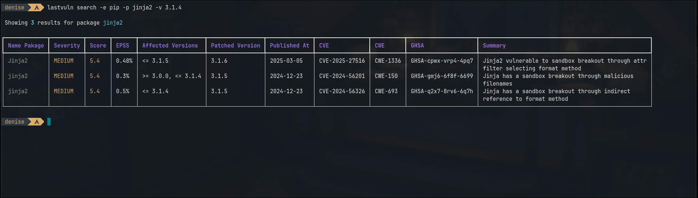
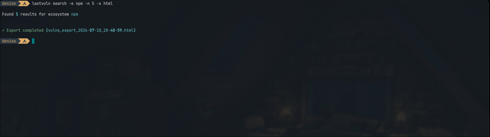
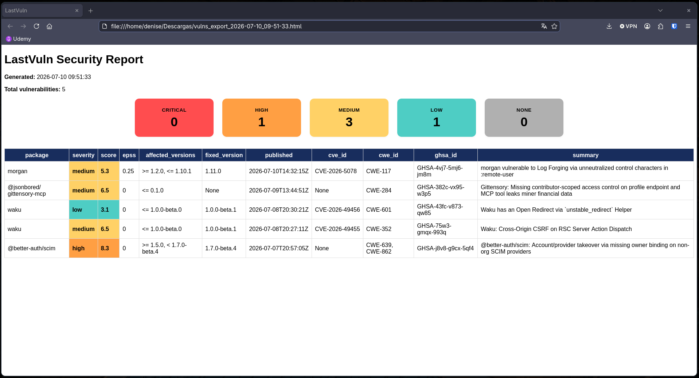
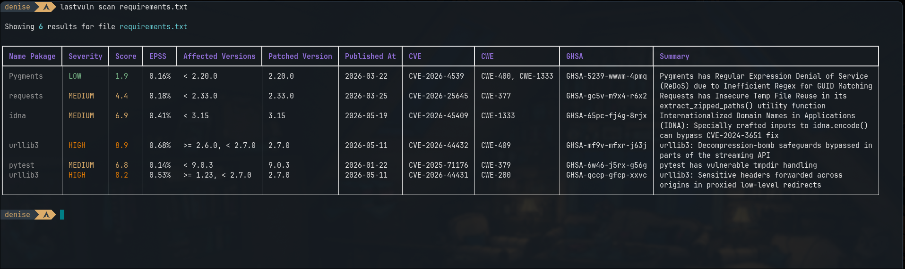
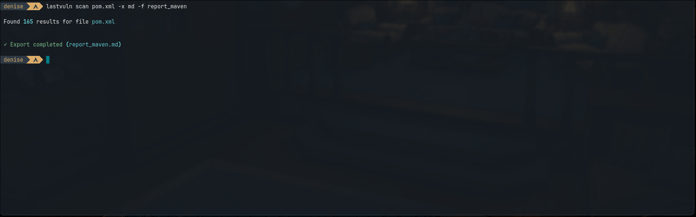
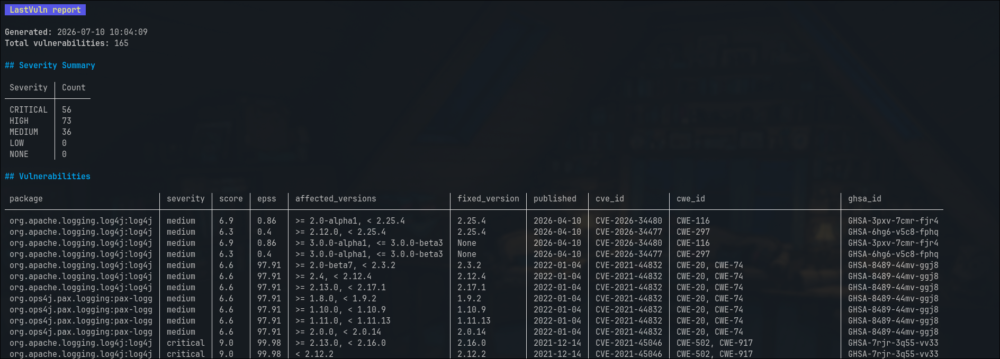
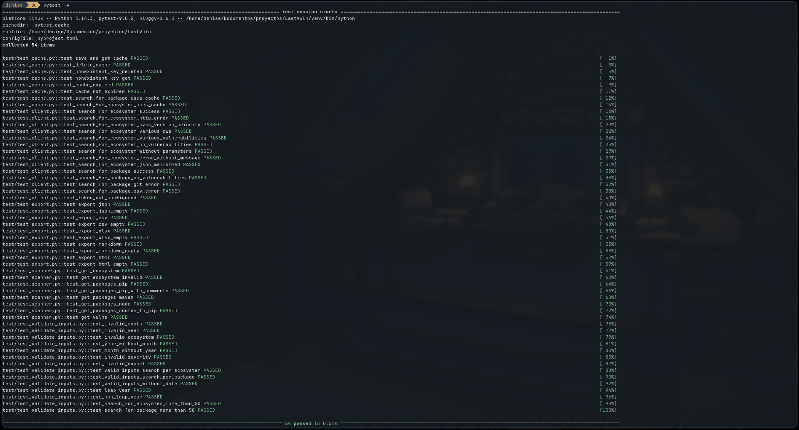

[English](README.en.md)

# Lastvuln CLI

## Buscador y escaneador de vulnerabilidades por ecosistema de paquetes

Investiga las últimas vulnerabilidades publicadas y escanea tus archivos de paquetes.

## ¿Por qué Lastvuln CLI?

Al desarrollar un proyecto, la selección y actualización de paquetes requiere mantener 
un equilibrio entre estabilidad, compatibilidad y seguridad. Las vulnerabilidades conocidas 
en librerías pueden convertirse en vectores de ataque si no son identificadas y gestionadas
oportunamente.

Lastvuln nació a partir de una necesidad real al trabajar con una aplicación web heredada 
con paquetes en versiones antiguas, donde se presentó una fuga de información. Las herramientas 
convencionales de análisis tardaban demasiado debido a que realizaban escaneos completos del proyecto
y agregaban múltiples funcionalidades que aumentaban su complejidad de uso, además del consumo de 
recursos requerido para su ejecución.

Además, aunque los editores de código detectaban vulnerabilidades en algunos paquetes, la información 
proporcionada no siempre era suficiente para tomar decisiones rápidas.
Por esta razón surgió la idea de crear una herramienta ligera, enfocada en obtener información relevante 
sobre vulnerabilidades de paquetes y facilitar la toma de decisiones técnicas.

## Características 

- **Búsqueda por ecosistema:** muestra las últimas vulnerabilidades de un ecosistema determinado, 
ordenadas por fecha de publicación.
- **Búsqueda por paquete:** muestra las últimas vulnerabilidades del paquete indicado, ordenadas por fecha de publicación.
- **Escaneo de archivos de paquetes.**
- Integración con OSV API.
- Integración con GitHub Advisory Database.
- Caché local SQLite.
- Exportaciones a Markdown, HTML, JSON, CSV y Excel.

### Ecosistemas soportados del modo escaner

| Ecosistema | Archivo de paquetes |
|-----------|---------------|
| PyPI      | requirements.txt |
| Maven     | pom.xml |
| npm       | package-lock.json |

## Instalación 

```bash 
git clone https://github.com/DeniseDiaz13/LastVuln.git

cd LastVuln

python -m venv .venv

source .venv/bin/activate

pip install -r requirements.txt
```

## Uso

```bash
lastvuln search [OPCIONES]
```

```bash
lastvuln scan [OPCIONES] ARCHIVO 
```

### Opciones 

| Corto | Largo | Tipo de búsqueda | Descripción |
|:---|:--------------------------------------|:----------------------------|:---|
| `-e` | `--ecosystem` | Ecosistema, paquete | Ecosistema de paquetes a consultar |
| `-n` | `--n_rows` | Ecosistema, paquete | Número de filas que se mostrarán en consola. |
| `-y` | `--year` | Ecosistema | Año de publicación de las vulnerabilidades. |
| `-m` | `--month` | Ecosistema | Mes de publicación de las vulnerabilidades. |
| `-s` | `--severity` | Ecosistema | Nivel de severidad de las vulnerabilidades. |
| `-p` | `--package` | Paquete | Nombre del paquete a consultar. |
| `-v` | `--version` | Paquete | Versión específica del paquete. |
| `-x` | `--export` | Ecosistema, paquete | Exportación de vulnerabilidades para reportes. |
| `-f` | `--filename` | Ecosistema, paquete | Nombre personalizado para el archivo exportado. |

### Ejemplos de uso

```bash
lastvuln search -e pip -p jinja2 -v 3.1.4
```

```bash
lastvuln search -e npm -n 5 -x html
```

```bash
lastvuln scan requirements.txt
```

```bash
lastvuln scan pom.xml -x md -f report_maven
```

### Capturas de pantalla 

Búsqueda por paquete
 

Búsqueda por ecosistema NPM y exportación a formato HTML



Escaneo de archivo requirements.txt


Búsqueda por ecosistema maven y exportación a formato Markdown



## Variables de entorno

Crea un token de acceso personal de GitHub y configúralo en el archivo `.env`:

```bash
GITHUB_TOKEN="tu_token"
```

## Pruebas automatizadas  

El proyecto cuenta con pruebas automatizadas para validar las funciones principales del cliente API,
manejo de errores, caché local, procesamiento de archivos de paquetes y lógica del escáner.


